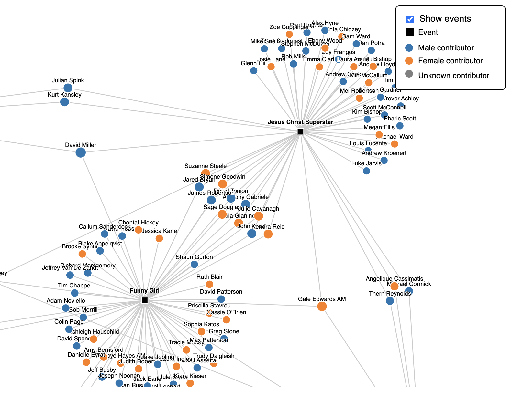

# 🎭 Kelley Abbey's Victorian Stage Contribution and Collaboration Network

This repository contains my D3.js interactive network visualisation project exploring Kelley Abbey’s stage contributions and collaboration patterns in Victorian performing arts data. The project presents both an event-contribution network and a collaboration network, allowing users to examine contributors, events, and professional connections through an interactive interface.

---

## 📌 Introduction

This project visualises performing arts relationships linked to Kelley Abbey using network diagrams. It focuses on two connected views of the data.

The first view is an event-contribution network, where event nodes are linked to contributors involved in each production. The second view is a collaboration network, where contributors are directly connected based on shared event participation. Users can switch between these two views using a checkbox in the legend.

The visualisation was developed in D3.js and includes interaction features such as zooming, dragging, tooltips, labels, and highlighting of connected nodes and links.

---

## 💡 Motivation

Network visualisation is a useful way to reveal patterns that are difficult to see in raw tables alone. In performing arts data, it can help show not only which events a person contributed to, but also how collaboration groups form around productions.

This project was motivated by the need to better understand:
- how Kelley Abbey’s event contributions are distributed across productions
- which contributors appear in the same clusters
- how collaboration ties emerge when events are removed
- how node type, gender, and connection strength can be encoded visually

---

## 📊 Key Visualisations

### 1. Event Contribution and Collaboration Network

This network visualisation displays events and contributors connected to Kelley Abbey’s Victorian stage work. Event nodes are shown as black squares, while contributor nodes are shown as coloured circles. Contributor colour indicates sex, with blue for male, orange for female, and grey for unknown. The visualisation also supports switching to a collaboration-only network, where link thickness reflects the number of shared collaborations. :contentReference[oaicite:2]{index=2} :contentReference[oaicite:3]{index=3}

---

## 🔍 Project Highlights

- Built an interactive network visualisation using **D3.js**
- Displayed two network modes:
  - event-contribution network
  - collaboration network
- Used different node symbols for events and contributors
- Coloured contributor nodes by sex
- Scaled contributor node size by number of collaborators
- Scaled collaboration link thickness by edge weight
- Added labels for both events and contributors
- Added a custom legend with a checkbox to toggle network modes
- Included tooltips with detailed node attributes
- Enabled zooming, panning, dragging, and hover-based highlighting :contentReference[oaicite:4]{index=4} :contentReference[oaicite:5]{index=5}

---

## 🧪 Methods Used

### Network Visualisation
- **Force-directed layout** for positioning nodes
- **Pan and zoom** interaction for network exploration
- **Drag interaction** for manual node repositioning
- **Dynamic network switching** between two JSON datasets

### Visual Encoding
- **Shape** to distinguish events and contributors
- **Colour** to distinguish contributor sex
- **Size** to represent number of collaborators
- **Link width** to represent collaboration strength
- **Labels and tooltips** for node identification and detail-on-demand :contentReference[oaicite:6]{index=6} :contentReference[oaicite:7]{index=7}

---

## 🛠️ Tools and Libraries

- **HTML**
- **CSS**
- **JavaScript**
- **D3.js v7** :contentReference[oaicite:8]{index=8}

---

## 📁 Files

- `FIT5147S12025_PE3_Template.html` — main file containing the layout, styling, legend, tooltip, interaction logic, and D3 network visualisation :contentReference[oaicite:9]{index=9}
- `Screenshot 2026-04-10 at 1.33.49 am.png` — network visualisation screenshot
- `event_contribution_network.json` — event-contribution network dataset
- `collaboration_network.json` — collaboration network dataset

---

## ▶️ How to Run the Code

1. Open the project folder in **VS Code** or another code editor
2. Make sure the HTML file is saved in the project directory
3. Ensure internet access is available, since the project loads **D3.js** and the JSON files from online sources
4. Open the HTML file in a browser

If you want to run it through a local server, you can use a simple extension such as **Live Server** in VS Code.

---

## 📌 Key Insights

- Productions with large contributor clusters stand out clearly in the event-contribution network.
- Switching off event nodes reveals a clearer collaboration structure centred around Kelley Abbey.
- Link thickness in the collaboration view helps identify repeated working relationships.
- Node size helps highlight contributors with broader collaboration reach.
- Hover interaction and highlighting make it easier to trace relationships within dense network clusters. :contentReference[oaicite:10]{index=10} :contentReference[oaicite:11]{index=11}

---

## 🎓 Academic Context

This project was completed as part of **FIT5147** and focuses on interactive network visualisation design using D3.js. It demonstrates how visual encodings and user interaction can be combined to explore contribution and collaboration patterns in performing arts data.

---
